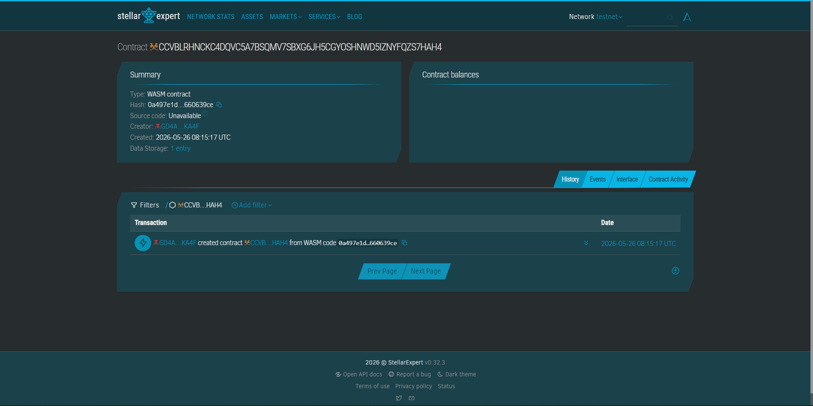

🛑 Kotong-Block
Eliminating roadside corruption through transparent, blockchain-based traffic enforcement.

🇵🇭 The Problem: "Kotong" Culture
In the Philippines, traffic enforcers often solicit bribes (informally known as "kotong") to avoid issuing official tickets. This happens because:

Opacity: Fines are issued on paper and can be "negotiated" away.

Inconvenience: Paying official fines often requires a whole day at a City Hall.

Lack of Accountability: There is no real-time, public record of violations.

This results in millions of pesos in lost government revenue and a breakdown of public trust.

💡 The Solution
Kotong-Block is a decentralized ticketing system built on Soroban (Stellar Smart Contracts).

Permanent Logging: When a violation occurs, the enforcer logs it on-chain. It cannot be deleted or modified.

Direct Payment: Drivers pay fines instantly using PHPT (Stellar PHP Stablecoin).

Automatic Settlement: Funds go directly to the Government Treasury contract—no cash ever touches the enforcer’s hands.

🛠 Features & Stellar Integration
Soroban Smart Contracts: Governs the issuance, tracking, and settlement of tickets.

PHPT Assets: Ensures price stability and ease of use for Filipino motorists.

Permanent Audit Trail: Every ticket, payment, and clearance is indexed on the Stellar ledger for public auditing.

Trustless Settlement: Eliminates the "middleman" during the payment process.

Contract ID Link: https://stellar.expert/explorer/testnet/contract/CCVBLRHNCKC4DQVC5A7BSQMV7SBXG6JH5CGYOSHNWD5IZNYFQZS7HAH4

