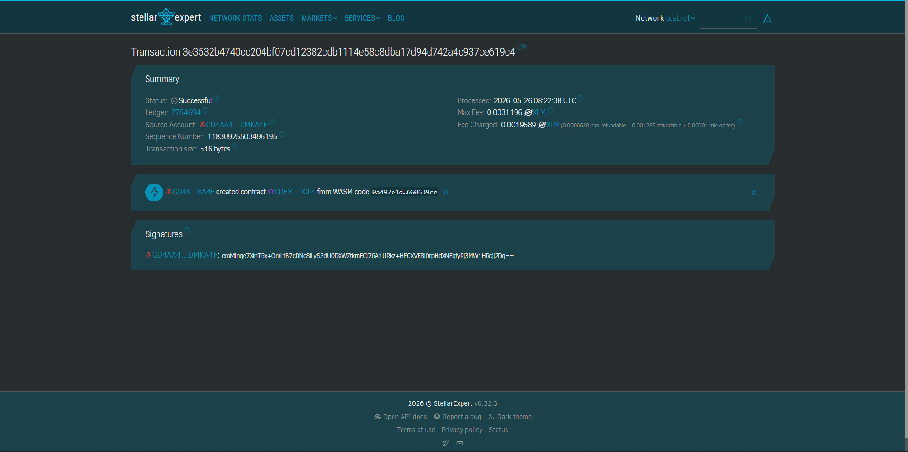

Kotong-Block
An anti-corruption traffic violation and payment system.

Problem: Traffic enforcers in the Philippines often solicit bribes ("kotong") to avoid issuing tickets, leading to lost government revenue and systemic corruption.
Solution: A Soroban-based ticketing system where violations are permanently logged on-chain. Drivers pay fines directly to the Treasury in PHPT, making the process transparent and bribe-proof.

Timeline
Build: 48 Hours

Stellar Features: Soroban, PHPT Assets, Permanent Audit Trail.

Vision
To modernize Philippine road enforcement and ensure that 100% of traffic fines go to the city budget rather than into the pockets of corrupt officials.

Usage
soroban contract build
cargo test

Contract ID: CCVBLRHNCKC4DQVC5A7BSQMV7SBXG6JH5CGYOSHNWD5IZNYFQZS7HAH4

